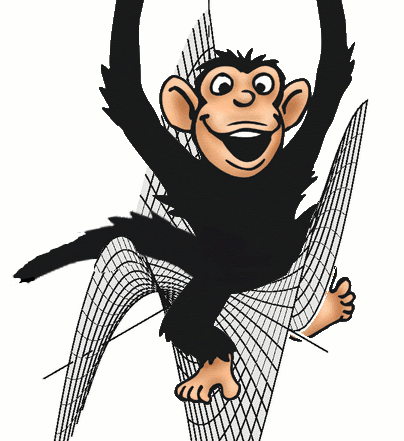

# Other Stuff

## Monkey Saddle

Remember: a monkey saddle is a saddle for a monkey to sit on — not a saddle for you to sit on a monkey (now published in [Gaeta-Virga,p9](https://link.springer.com/article/10.1140/epje/i2016-16113-7).)

