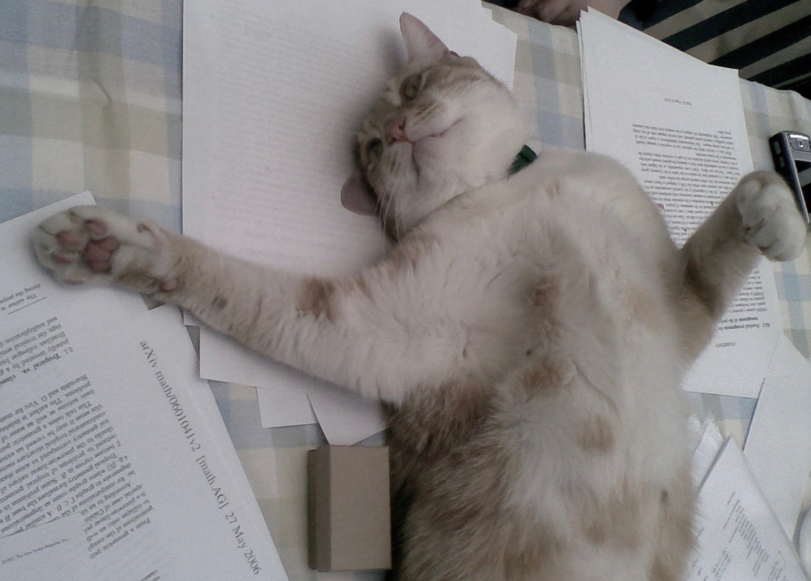
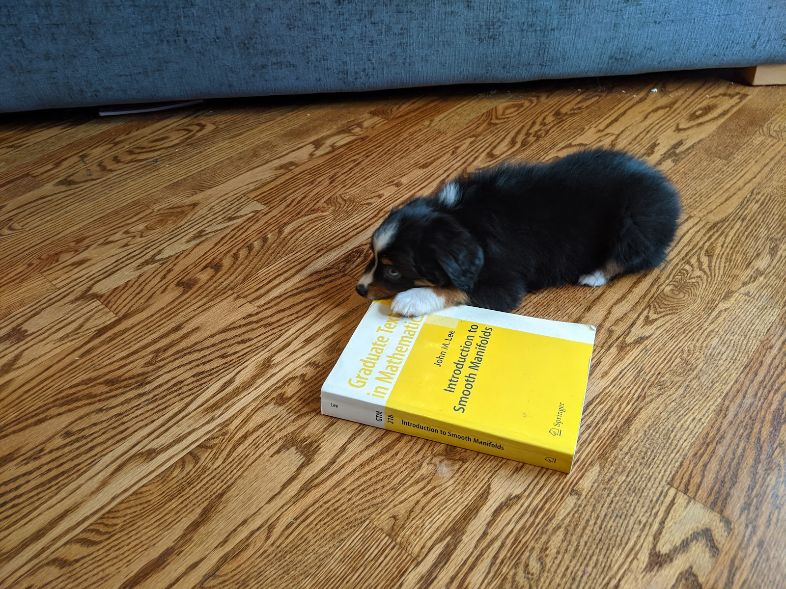

# Pets

I have had two cats and a dog. These are their stories…

## Update (Aug 2012)
Aero has now essentially moved out (after the birth of our first child), and is being cared for by a network of elderly neighbours. Wispa’s loyalty however is unfaltering, and she passively endures endless toddler abuse.

## Update (Nov 2013)  
Aero is around more often now, we now see him several times a week. Not sure what has changed. Wispa is resigned to being chased around the house, mornings, evenings and weekends.

## Update (Sep 2016)  
I am asked for updates on this topic surprisingly often, so here goes: both cats are well. Wispa now endures abuse from two children, and Aero is alive but ever fatter and never around.

## Update (Sep 2017)  
We are about to return to the United States, and decided that Aero was better off left in the UK with his new “owner”. Wispa’s loyalty is to be rewarded with her second international flight, Gatwick→Reykjavik→Chicago, at which point she will return to being an inside cat.

## Update (Sep 2018)  
Having worn us down, Wispa is now allowed outside again which she does only when it suits her.

## Update (March 2019)  
Wispa went out and got lost for two days. She was found only after a concerted effort from what felt like the entire of Bucktown following a plea for help on Facebook. I never again want to hear complaints about the ills of social media.

## Update (June 2020)  
It is not at all clear that Wispa enjoys having the entire family around 24 hours a day, seven days a week.

## Update (Nov 2020)  
We got a lockdown pup (to arrive December 30th). He is a miniature Australian Shepherd to be named Shelford, after the village in the UK where we lived when the kids were born.

## Update (March 2023)
At the ripe old age of about 20 (which is 93 in human years) Wispa has some kind of stroke and quickly became immobilized. I was pleased to have her for those last days; she will be forever missed.

## Update (June 2024)  
Lesson learned: dogs are more expensive that you could possibly imagine (but still worth it). Only complaint is that he’s learned to bark!  
