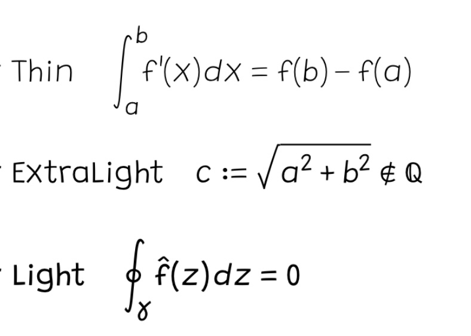
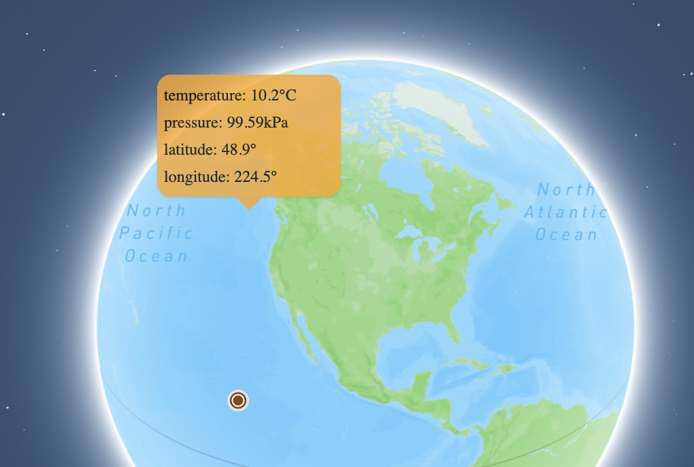
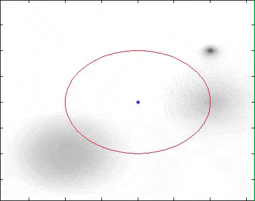

# Software

## Pennstander 

An opentype text and mathematics font based on Grandstander ([source](https://github.com/juliusross1/Pennstander)).

## The Borsuk-Ulam Explorer

(Joint with Colin Cotter) We have created an outreach/educational page that illustrates the amazing Borsuk-Ulam Theorem with live weather data   ([explorer](http://julius-ross.com/Borsuk-Ulam/),[source](https://github.com/colinjcotter/borsukulam)).

## Accessible LaTeX Thesis Template

Simple LaTeX template for writing thesis that is tested also with LaTeXML to produce accessible epub files.  It was written for a UIC thesis, but likely can be adapted easily ([source](https://github.com/juliusross1/Accessible-LaTeX-Thesis-Template))

## The Hele-Shaw Toolkit

(Joint with David Witt Nyström) This is a MATLAB package to simulate the Hele-Shaw flow in the plane with varying permeability ([source](https://github.com/juliusross1/HeleShawToolbox)).

